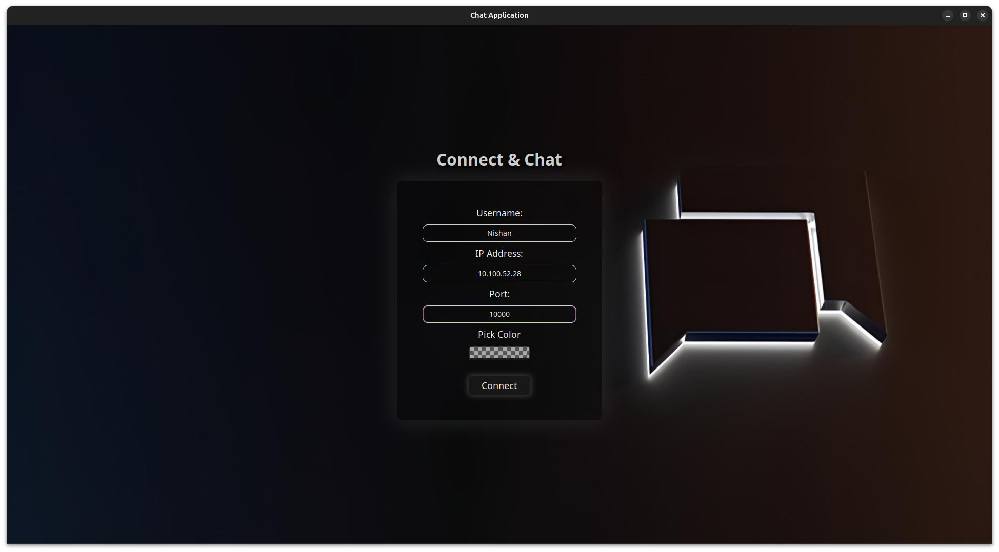

# Chat-Room





## About 
The ChatRoom application is a C++ project that creates a simple chat room where multiple clients can connect to a server and message each other in real time. The server handles client connections, message broadcasting, and ensures thread safety. The client provides a graphical user interface (GUI) using GTK for sending and receiving messages.

## Features

- Multiple clients can connect to the server.
- Simple GUI for clients to enter username, IP address, and port.
- Messages are broadcast to all connected clients.
- Gracefully handles client disconnections.


## Prerequisites

- Linux operating system
- CMake
- GTKmm 4.0

## Installation

To install and run chatroom, follow following steps:

### Clone the repository
```bash
git clone https://github.com/yourusername/Chat-Room.git
cd Chat-Room
```
### Install CMake
```bash
sudo apt-get update
sudo apt-get install -y cmake
```
### Install GTKmm 4.0
```bash
sudo apt-get update
sudo apt-get install -y libgtkmm-4.0-dev
```
## Building the Project
Build Client And Server
```bash
mkdir build
cd build
cmake ..
make
```

## Running the Application
Make sure you're in build directory.

1. Start the server:
    ```bash
    ./server/server
    ```

3. Start a client:
    ```bash
    ./client/chat_client
    ```

## Usage

1. Launch the server on a machine within your local network.
2. Launch the client on the same or another machine within the same network.
3. Enter your username, server IP address, and port (default is 10000) in the client GUI and click "Connect".
4. Start chatting!
